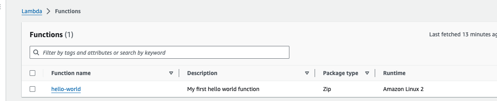
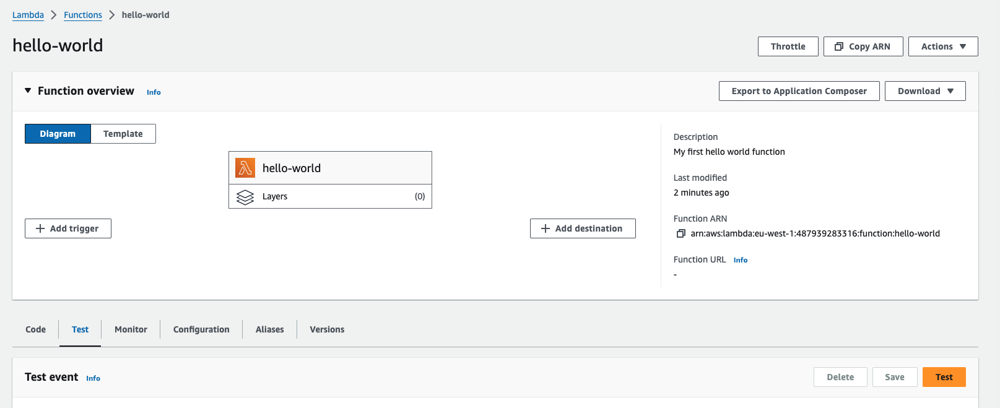
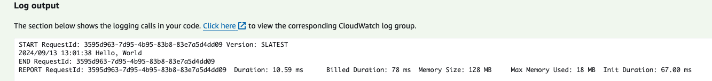
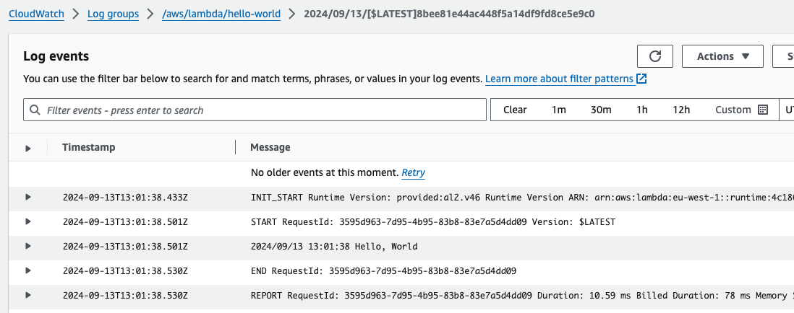

# AWS Lambda function golang with Terraform

This is a simple repository with a golang application for AWS lambda that just says hello-world and send the logs to cloudwatch 

# Prerequisites

## AWS
- AWS account  

## Install terraform  
See the following documentation [How to install Terraform](https://learn.hashicorp.com/tutorials/terraform/install-cli)

## Golang
Have Go installed on your machine as described [here](https://go.dev/doc/install)


# How to

- Clone the repository to your local machine
```
git clone https://github.com/munnep/aws_lambda_example.git
```
- Go to the directory
```
cd aws_lambda_example
```
- Set your AWS credentials
```
export AWS_ACCESS_KEY_ID=
export AWS_SECRET_ACCESS_KEY=
export AWS_SESSION_TOKEN=
```
- Terraform initialize
```
terraform init
```
- Terraform plan
```
terraform plan
```
- Terraform apply
```
terraform apply
```
- Terraform output should create 6 resources
```

Plan: 6 to add, 0 to change, 0 to destroy.
```
- Go to AWS to test the lamdba function
  
- Do a test by clicking on it
  
- The output will show you a hello-world
  
- Cloudwatch logs will show the same  
   


